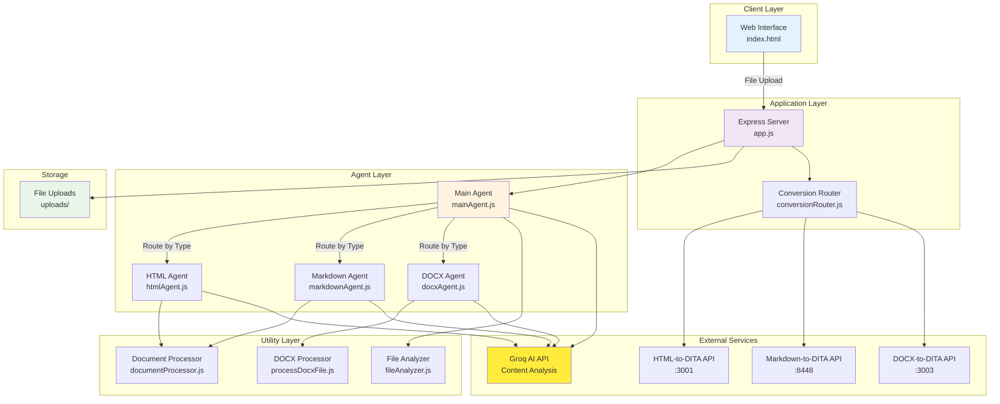

# AI Agent Parser - High-Level Architecture

## Architecture Components

### Client Layer
- **Web Interface**: Drag-and-drop file upload UI

### Application Layer
- **Express Server**: Main HTTP server handling requests
- **Conversion Router**: Routes to appropriate DITA conversion APIs

### Agent Layer
- **Main Agent**: Orchestrates processing, AI type detection
- **HTML Agent**: Specialized HTML processing and cleanup
- **Markdown Agent**: Markdown formatting and syntax fixing
- **DOCX Agent**: DOCX extraction and content structuring

### Utility Layer
- **Document Processor**: Common document processing utilities
- **File Analyzer**: File analysis and validation utilities
- **DOCX Processor**: Specialized DOCX file handling

### External Services
- **Groq AI**: Content analysis and cleanup
- **DITA APIs**: Convert processed content to DITA format

### Storage
- **File Uploads**: Temporary storage for uploaded files