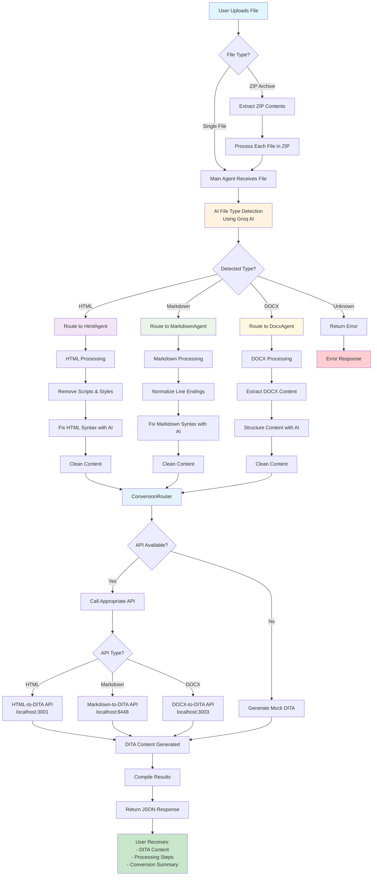

# AI Agent Document Parser - Flow Diagram

## Process Flow Description

### 1. File Upload Stage
- User uploads file(s) through web interface
- System handles both single files and ZIP archives
- ZIP files are extracted and each contained file is processed individually

### 2. Main Agent Processing
- Receives uploaded file(s)
- Uses Groq AI for intelligent file type detection
- Routes files to appropriate specialized agents

### 3. Specialized Agent Processing

#### HtmlAgent
- Removes unwanted scripts, styles, and attributes
- Uses AI to fix HTML syntax issues
- Prepares clean HTML content

#### MarkdownAgent
- Normalizes line endings and spacing
- Uses AI to fix markdown syntax issues
- Prepares clean markdown content

#### DocxAgent
- Extracts content from DOCX files
- Uses AI to structure content properly
- Prepares clean structured content

### 4. DITA Conversion
- ConversionRouter handles API calls
- Routes to appropriate conversion API based on file type
- Falls back to mock DITA generation if APIs unavailable

### 5. Result Compilation
- Aggregates all processing results
- Compiles conversion summary
- Returns structured JSON response with DITA content

## API Endpoints Used
- **HTML to DITA**: `http://localhost:3001/convert/html-to-dita`
- **Markdown to DITA**: `http://localhost:8448/api/markdowntodita`
- **DOCX to DITA**: `http://localhost:3003/convert/docx-to-dita`

## Key Features
- **AI-Powered**: Uses Groq AI for content analysis and cleanup
- **Fault Tolerant**: Handles API unavailability with mock responses
- **Multi-Format**: Supports HTML, Markdown, DOCX, and ZIP files
- **Specialized Processing**: Each file type gets tailored treatment