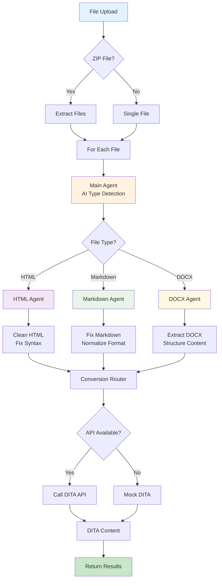

# AI Agent Parser - Process Flow

```mermaid
flowchart TD
    A[File Upload] --> B{ZIP File?}
    B -->|Yes| C[Extract Files]
    B -->|No| D[Single File]
    C --> E[For Each File]
    D --> E
    
    E --> F[Main Agent<br/>AI Type Detection]
    F --> G{File Type?}
    
    G -->|HTML| H[HTML Agent]
    G -->|Markdown| I[Markdown Agent]
    G -->|DOCX| J[DOCX Agent]
    
    H --> H1[Clean HTML<br/>Fix Syntax]
    I --> I1[Fix Markdown<br/>Normalize Format]
    J --> J1[Extract DOCX<br/>Structure Content]
    
    H1 --> K[Conversion Router]
    I1 --> K
    J1 --> K
    
    K --> L{API Available?}
    L -->|Yes| M[Call DITA API]
    L -->|No| N[Mock DITA]
    
    M --> O[DITA Content]
    N --> O
    
    O --> P[Return Results]
    
    style A fill:#e3f2fd
    style P fill:#c8e6c9
    style F fill:#fff3e0
    style H fill:#f3e5f5
    style I fill:#e8f5e8
    style J fill:#fff8e1
```